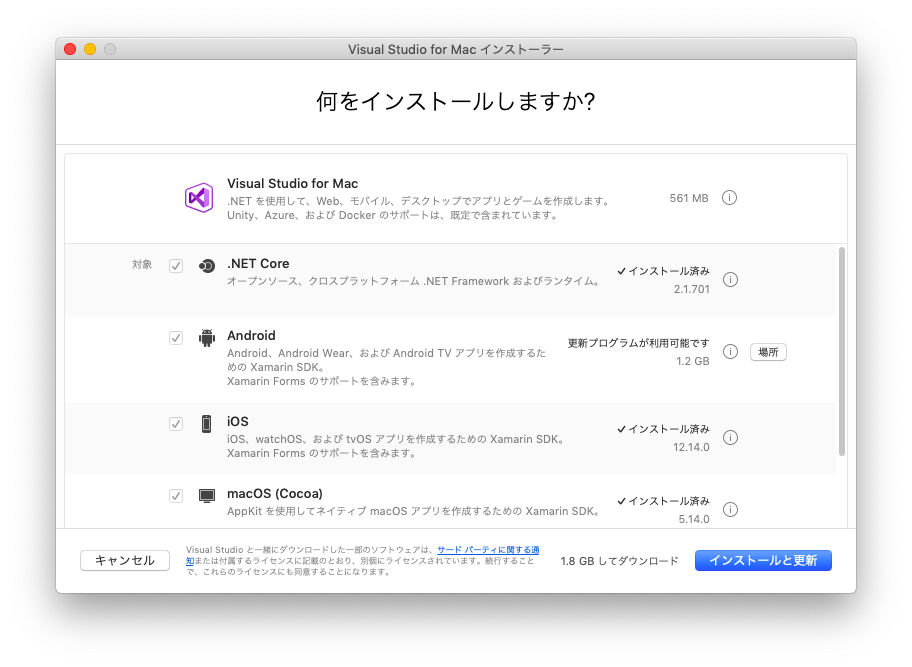
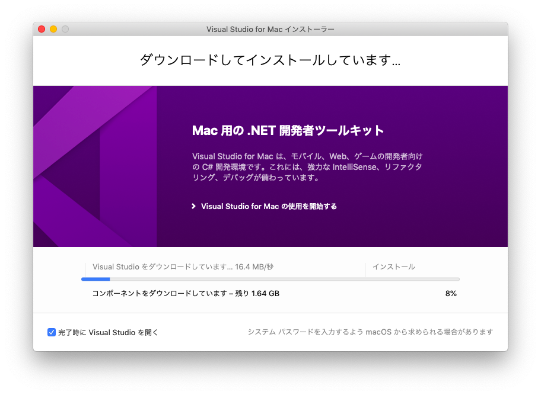
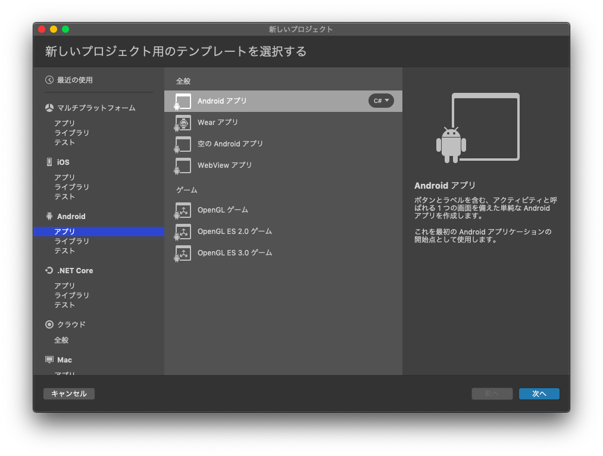

# アプリを作るための準備
## 開発環境を整える
### 1.1.1 PC側での準備
Androidのアプリを作ろうと思うと，今は色々な環境を選択することができる．
Javaとか，Kotlinとか，もしかしたらCocoaとかも聞いたことがあるかもしれない．

今回は，C#を用いてAndroidを開発することのできる`Xamarin`というフレームワークに焦点を合わせてみたいと思う．  
`Xamarin`というのは，Androidアプリを作る上で欠かすことのできない`Android SDK`をC#でも使えるようにしたもの．  
この，`Xamarin`というフレームワークは`Visual Studio`を使って開発することができる．  
以降，インストールの手順を見ていきたいと思う.  
~~正直なところこんな節はなくてもいいんじゃないかなぁなんて思ってたり~~





### 1.1.2 端末側での準備
実機でAndroidアプリの開発を行おうと思うと，`開発者向けオプション`を選択できるようにしなければいけない．  
**端末設定 > システム > 端末情報**と進んで**ビルド番号**を7回タップすると，**端末設定 > システム**に`開発者向けオプション`という項目が追加されるはずだ．

## 1.2

# 初めてのAndroidアプリケーション
## プロジェクトの作成
第1章で開発環境の作成を終えたら，早速Androidアプリの作成に挑戦してみたいと思う．  



プロジェクトが出来上がったら，まずは何も考えずに実行してみよう．


## 出力されたコードを見てみる
勝手に作られたプログラムをじっくりとみていこう．

`Resources/layout/activity_main.xml`というファイルがあるかと思う．これがアプリのレイアウトを決めているファイルだ．  

```
<?xml version="1.0" encoding="utf-8"?>
<RelativeLayout
  xmlns:android="http://schemas.android.com/apk/res/android"
  xmlns:app="http://schemas.android.com/apk/res-auto"
  xmlns:tools="http://schemas.android.com/tools"
  android:layout_width="match_parent"
  android:layout_height="match_parent">
</RelativeLayout>
```

それともう一つ，`MainActivity.cs`を見てみよう．  
あとで詳しく解説するが，Androidアプリには`Activity`という動作単位が存在する，このファイルにはそんなActivityの動作を決める記述がなされている．  

```
using Android.App;
using Android.OS;
using Android.Support.V7.App;
using Android.Runtime;
using Android.Widget;

namespace test {
 [Activity(Label = "@string/app_name",
  Theme = "@style/AppTheme",
  MainLauncher = true)]
 public class MainActivity : AppCompatActivity {
  protected override void OnCreate(Bundle savedInstanceState) {
   base.OnCreate(savedInstanceState);
   Xamarin.Essentials.Platform.Init(this, savedInstanceState);
   // Set our view from the "main" layout resource
   SetContentView(Resource.Layout.activity_main);  // (1)
  }

  // (2)
  public override void OnRequestPermissionsResult(int requestCode,
     string[] permissions,
     [GeneratedEnum] Android.Content.PM.Permission[] grantResults) {
   Xamarin.Essentials.Platform.OnRequestPermissionsResult(requestCode, 
        permissions, 
        grantResults);

   base.OnRequestPermissionsResult(requestCode, 
        permissions, 
        grantResults);
  }
 }
}
```  

**(1)** では，アプリケーションのレイアウトを設定している．  
自動生成されたアプリケーションでは`Resources/layout/activity_main.axml`で定義されている．  
**(2)** では，Android6から実装されたいわゆる**Mパーミッション**に関する設定を行うためのコールバックである．  
今回は特に気にしなくても良い．必要になったら説明したいと思う．  

さて，自動生成されたプログラムを実行したところで特に何が表示されるわけでもなく，タイトルと白い画面のみのアプリだったことだろう．  
次回以降の章では，このアプリケーションに手を加えてアプリらしいアプリを作るための技術を磨いていこう．


# データの入出力
## 出力するための手段
### 3.1.1 TextView
画面に情報を表示する際，TextViewは有用な手段であると言える．  
まずはレイアウトファイルとそれに付随するプログラムを見て欲しい．

```
<TextView 
  androud:id="@+id/textview1"
  android:text="これはTextViewです"
/>
```

```
  var tv = FindViewById<TextView>(Resource.Id.textview1);
  tv.text = "テキストを変更しました";
```

### 3.1.2 Progress Bar

### 3.1.3 Toast通知  
ボタンを押した時とかに，何かしらの情報が画面下にポップアップ表示されるような経験は誰しもがしたことがあるだろう．その時に現れるポップアップ表示のことをToast通知という．  
Toast通知の表示のさせ方を見てみよう

```
  Toast.MakeText(ApplicationContext,
       "Toast通知", 
       ToastLength.Short).Show();
```
このように記述するだけでデータをポップアップ表示することができるので，ぜひ知っておいて欲しい．  
また，Toastの表示スタイルは様々な形式にカスタムすることができる．

### 3.1.4 通知バー

## 入力するための手段
### 3.2.1 Button
何かしらのアクションのトリガーとして非常に有用な手段であるボタンの実装について解説する．  
まずは，サンプルコードを見て欲しい

```
<Button
  android:id="@+id/button1"
  android:text="押してみてね"
/>
```

```
  var button = FindViewById<Button>(Resource.Id.button1);
  button.Click += (sender, e) => {
    Toast.MakeText(ApplicationContext,
         "ボタンが押されたよ", 
         ToastLength.Short).Show();
  };
```

### 3.2.2 Text

### 3.2.3 CheckBox

### 3.2.4 SeekBar

### 3.2.5 Toggle Button

# ハードウェアの利用
## センサー
### 4.1.1 加速度センサー

### 4.1.2 ジャイロセンサー

### 4.1.3 近接センサー

## GPS : Global Positioning System
位置情報を使ったアプリケーションを作ろうと思った場合，GPSの利用は必要不可欠であると言える．そこで，本章ではGPSの使用方法について解説したいと思う．  

### 4.2.1 GPSの有効化

## カメラ

## NFC : Near Field Communication

## ストレージの利用


# 様々なActivity
## Activityのライフサイクル

## Activityの遷移
### 5.2.1 データの受け渡しをしない場合

### 5.2.2 データの受け渡しをする場合

### 5.2.3 外部のアプリケーションを呼び出す
例えばリンクをクリックした時，勝手にブラウザが立ち上がったり，はたまたどのブラウザを使用するか選択させられたりといった経験はあるのではないだろうか．  
このように外部のアプリケーションを立ち上げるのは，一種のActivity遷移に分類されると筆者は考えている．  
そこで，外部のアプリケーションを呼び出す方法をいくつか紹介する．

### 明示的Intent

### 暗黙的Intent

# Background Service

# Design Support Libraryを使う

## TabbedLayoutなアプリケーション
本節では，Tabbed Layoutなアプリケーションの作り方を解説していく．
### 7.1.1 Fragmentの実装
### 7.1.2 Adapterの実装
### 7.1.3 AdapterとLayoutの紐付け

## Swipe Refresh Layout
某SNSとかで，下にスワイプして手を離した時にクルクルしたものが表示されるのを見たことがあるかと思う．  
本節ではそのような機能の実装に挑戦してみたいと思う．

# 第8章 Android Support Libraryを使う
## ToolBar

# あとがき